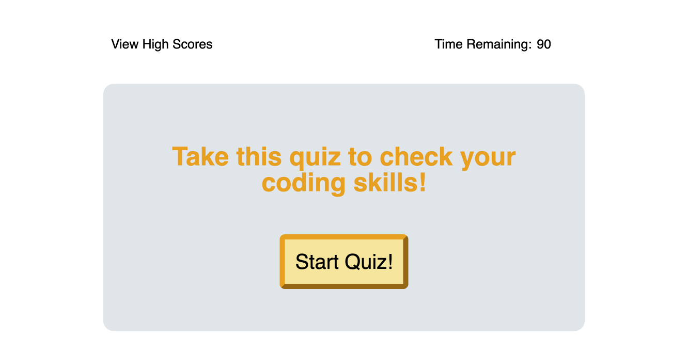

# coding-quiz-time
## Description
The goal of this challenge is to create a quiz that asks coding-related questions, tracks highscores, and incorporates a timer. 

This is currently a work in progress. I will be coming back to this to resubmit ASAP.

## Acceptance Criteria
1. When the user clicks the start button, a timer starts and the first question appears.
2. When the user answers a question, they are presented with another question.
3. When the user answers a question incorrectly, they lose time on the timer.
4. When all questions are answered, or the timer equals zero, the quiz is over.
5. When the quiz has ended, the user can enter their initials and save their score.

## Screenshot of page

## Deployed Application
Click [here](https://indigofobes.github.io/coding-quiz-time/develop/) for live URL.

Click [here](https://github.com/IndigoFobes/coding-quiz-time.git) for GitHub repository.
